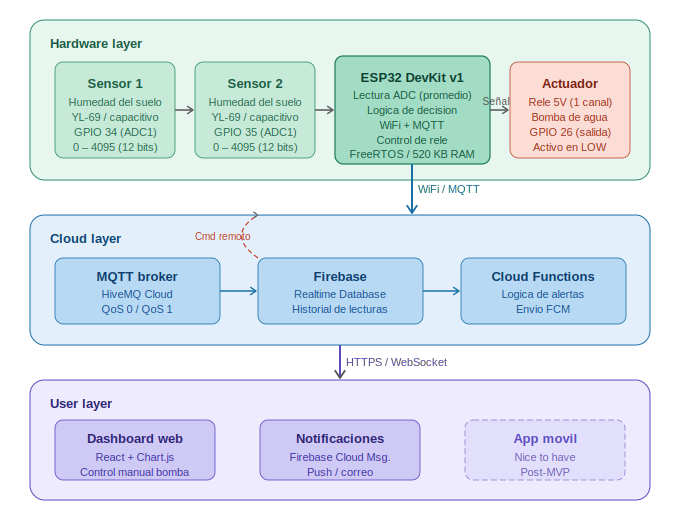
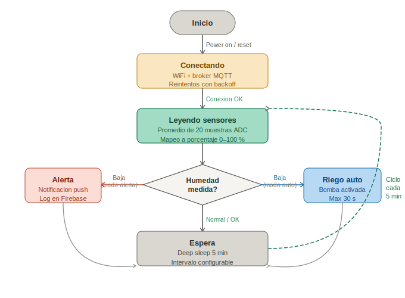

# HydroSense

Sistema IoT de monitoreo de humedad del suelo y riego automático de plantas, basado en ESP32 con integracion a la nube y dashboard en tiempo real.

---

## Tabla de contenido

- [Visión del proyecto](#vision-del-proyecto)
- [Arquitectura del sistema](#arquitectura-del-sistema)
- [Componentes técnicos](#componentes-tecnicos)
- [Restricciones del sistema](#restricciones-del-sistema)
- [Reporte del spike](#reporte-del-spike)
- [Instrucciones de instalación](#instrucciones-de-instalacion)
- [Equipo](#equipo)

---

## Visión del proyecto

### Problema que resuelve

El riego manual de plantas es inconsistente e ineficiente. Las principales consecuencias son:

- Muerte de plantas por falta de riego o por exceso de agua.
- Ausencia de retroalimentación objetiva sobre el estado real del suelo.
- Ineficiencia en el uso del agua en entornos domésticos y cultivos urbanos.

### Solucion

HydroSense es un sistema embebido que mide continuamente la humedad del suelo a través de sensores conectados a un microcontrolador ESP32. Cuando la humedad cae por debajo de un umbral configurado, el sistema actua de dos maneras: Envia una notificación push al usuario o activa una bomba de agua de forma automática. Los datos se publican en la nube y son visibles desde un dashboard web en tiempo real.

### Usuarios objetivo

| Segmento | Descripción |
|----------|-------------|
| Hogares con plantas | Personas con plantas en interiores o balcones |
| Hogares inteligentes | Usuarios con ecosistemas domóticos |
| Pequeños agricultores | Cultivos urbanos, huertas caseras |
| Educacion STEM | Proyectos académicos de IoT y sistemas embebidos |

---

## Arquitectura del sistema

### Diagrama de bloques



El sistema esta organizado en tres capas:

**Hardware layer:** Dos sensores de humedad del suelo conectados al ADC1 del ESP32. El ESP32 lee las senales, aplica la lógica de decision y controla un rele que activa o desactiva la bomba de agua.

**Cloud layer:** El ESP32 publica los datos via MQTT a un broker en la nube (HiveMQ Cloud). Los datos se almacenan en Firebase Realtime Database. Firebase Cloud Functions se encarga de enviar notificaciones push al usuario cuando se detecta un nivel critico de humedad.

**User layer:** El usuario accede a un dashboard web (React) que muestra el estado de las plantas en tiempo real, el historial de lecturas y permite activar o desactivar la bomba de forma manual.

### Diagrama de estados del firmware



El firmware opera en un ciclo de cinco estados: Conectar, leer, decidir, actuar y esperar. Entre ciclos, el ESP32 entra en modo deep sleep para reducir el consumo energetico.

### Estructura del repositorio

```
hydrosense/
├── firmware/               # Codigo del ESP32 (PlatformIO)
│   ├── src/
│   │   ├── main.cpp
│   │   ├── sensors.cpp
│   │   ├── wifi_manager.cpp
│   │   └── mqtt_client.cpp
│   ├── include/
│   │   ├── config_template.h
│   │   └── thresholds.h
│   └── platformio.ini
├── dashboard/              # Aplicacion web (React)
│   ├── src/
│   └── package.json
├── cloud/                  # Firebase Cloud Functions
│   └── functions/
├── docs/                   # Documentacion tecnica
│   ├── architecture.svg
│   ├── states.svg
│   └── wiring_diagram.png
├── tests/                  # Pruebas unitarias
├── .github/
│   └── ISSUE_TEMPLATE/
├── BACKLOG.md
├── SPRINTS.md
├── SPIKE.md
└── README.md
```

---

## Componentes técnicos

### Hardware

| Componente | Modelo | Funcion | Precio aprox. (COP) |
|------------|--------|---------|----------------------|
| Microcontrolador | ESP32 DevKit v1 | Procesamiento, WiFi, logica | $22.000 |
| Sensor de humedad x2 | YL-69 o capacitivo v1.2 | Lectura de humedad del suelo | $8.000 c/u |
| Modulo rele | Rele 5V 1 canal | Control de la bomba | $5.000 |
| Mini bomba de agua | Bomba sumergible 3–5V | Riego | $12.000 |
| Fuente de alimentacion | Adaptador 5V 2A | Alimentacion del sistema | $10.000 |
| Manguera y tuberia | — | Conduccion de agua | $8.000 |
| Protoboard y cables | — | Prototipo | $10.000 |
| **Total estimado** | | | **~$83.000 COP** |

### Software y plataformas

| Capa | Tecnología | Justificación |
|------|-----------|---------------|
| Firmware | C++ / Arduino Framework | Compatibilidad con ESP32, documentacion amplia |
| Comunicacion | MQTT (PubSubClient) | Protocolo ligero, disenado para IoT |
| Plataforma IoT | Firebase Realtime Database | Gratuito, soporte en tiempo real |
| Alertas | Firebase Cloud Functions | Serverless, sin costo en uso bajo |
| Dashboard | React + Chart.js | Visualizacion de datos historicos |
| Notificaciones | Firebase Cloud Messaging | Push notifications sin servidor propio |

---

## Restricciones del sistema

### Restricciones tecnicas

| Restricción | Detalle | Mitigacion |
|------------|---------|------------|
| Memoria del ESP32 | 520 KB RAM; WiFi + MQTT usan ~60 KB | Minimizar buffers; usar QoS 0 para lecturas periodicas |
| ADC2 incompatible con WiFi | Los pines ADC2 del ESP32 no pueden usarse mientras WiFi esta activo | Usar exclusivamente pines ADC1: GPIO32–GPIO39 |
| No linealidad del ADC | El ADC del ESP32 es no lineal cerca de 0 V y 3.3 V | Calibrar con valores de referencia; usar `esp_adc_cal` |
| Consumo energetico | ~240 mA en transmision WiFi activa | Modo deep sleep entre ciclos de lectura (cada 5 min) |
| Latencia de red | WiFi domestico: 20–200 ms | No es crítico; el riego no requiere tiempo real estricto |
| Durabilidad del sensor | Los sensores resistivos (YL-69) se oxidan con el tiempo | Preferir sensores capacitivos en la version final |

### Restricciones del proyecto

- Presupuesto máximo de hardware para el prototipo: **$100.000 COP**
- Tiempo de desarrollo: **8 semanas** (proyecto)
- Infraestructura: servicios gratuitos unicamente (Firebase free tier, HiveMQ free tier)

---

## Reporte del spike

El spike técnico corresponde a la tarea [SPIKE-01] del Release 1. El objetivo fue validar dos incertidumbres técnicas críticas antes de iniciar el desarrollo del sistema completo.

### Spike 1: Estabilidad de lectura de los sensores de humedad

**Pregunta:** El ADC1 del ESP32 entrega lecturas con varianza suficientemente baja para diferenciar de forma confiable los estados SECO, NORMAL y SATURADO?

**Experimento:** Se tomaron 50 muestras del sensor YL-69 conectado al GPIO34 en tres condiciones distintas del suelo: Seco (sin regar 48 h), humedo (regado 1 h antes) y saturado (agua visible en superficie). Se calculó la media y la desviación estándar para cada condicion.

| Condición | Valor ADC promedio | Desv. estándar | Humedad (%) |
|-----------|--------------------|----------------|-------------|
| Seco | ~3.300 | ±48 | 0–18 % |
| Humedo | ~2.000 | ±32 | 38–60 % |
| Saturado | ~950 | ±24 | 80–100 % |

**Conclusión:** Viable. Promediar 20 muestras con 10 ms de separación reduce el ruido a niveles aceptables. Los tres estados son distinguibles con un margen amplio. Se definieron los umbrales operativos: SECO si humedad < 30 %, SATURADO si humedad > 75 %. Se recomienda migrar a sensor capacitivo en la version final para mayor durabilidad.

### Spike 2: Conectividad ESP32 a Firebase via MQTT

**Pregunta:** El ESP32 puede publicar datos a Firebase de forma confiable (> 95 % de mensajes entregados) con latencia aceptable en una red doméstica?

**Experimento:** Se publicaron 100 mensajes cada 5 segundos durante 10 minutos usando la librería PubSubClient hacia un broker HiveMQ Cloud (free tier). Se midió la tasa de entrega, la latencia promedio y el consumo de RAM adicional.

| Métrica | Resultado |
|---------|-----------|
| Tasa de entrega | 98.5 % (2 timeouts por reconexion) |
| Latencia promedio | ~180 ms |
| RAM adicional usada | ~45 KB |
| Tiempo de reconexión | < 8 s |

**Conclusión:** Viable. La tasa de entrega supera el umbral objetivo. La latencia es aceptable para el caso de uso. Se implementara reconexión automática con backoff exponencial para manejar los casos de pérdida temporal de conexión.

---

## Instrucciones de instalación

### Requisitos previos

- PlatformIO IDE o Arduino IDE 2.x
- Node.js 18 o superior
- Cuenta en Firebase (plan gratuito)
- Hardware listado en la seccion de componentes

### Firmware (ESP32)

```bash
git clone https://github.com/<organizacion>/hydrosense.git
cd hydrosense/firmware

cp include/config_template.h include/config.h
# Editar config.h con las credenciales WiFi y Firebase

pio run --target upload
```

### Dashboard web

```bash
cd hydrosense/dashboard
npm install

cp .env.example .env
# Editar .env con las credenciales de Firebase

npm run dev
```

---

## Equipo

| Nombre | Rol |
|--------|-----|
| Celeste Durán | Lider tecnico / Firmware |
| Diego Escalante | Backend / Nube |
| Camila Cano | Frontend / Dashboard |

---
